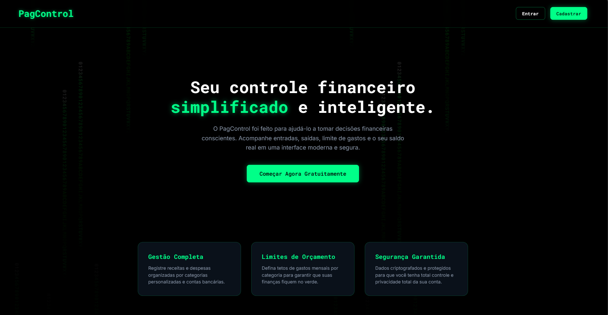
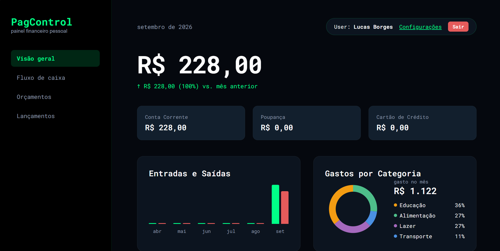

# PagControl (v2)

Oi! Esse é o repositório do **PagControl**, um projeto full-stack de controle financeiro pessoal que desenvolvi para aplicar e evoluir meus conhecimentos de programação.

A ideia aqui foi sair do clássico "todo list" e criar um dashboard real e funcional, onde o usuário consegue se cadastrar, lançar entradas e saídas e definir limites de gastos por categoria. Tudo isso com um visual bem particular inspirado na temática _Matrix_ (dark mode com neon verde), que está bem atualizado com o perfil atual.

## Telas do Projeto

### Tela Inicial (Landing Page)



### Painel Principal (Dashboard)



## Tecnologias que usei

Fiz questão de construir o front-end "na mão" para fixar bem os fundamentos, sem depender de bibliotecas visuais prontas:

- **Frontend:** HTML5, CSS3 e JavaScript puro (Vanilla JS).
- **Backend:** Python com FastAPI.
- **Banco de Dados:** SQLite (banco local) via SQLAlchemy.
- **Segurança:** Autenticação usando JWT (JSON Web Tokens) e senhas criptografadas.

## O que o sistema faz

- **Login e Cadastro:** Fluxo completo de autenticação e sessão de usuário.
- **Lançamentos Dinâmicos:** Registro de despesas e receitas. (Deu um pouco de trabalho fazer o JavaScript atualizar as categorias dinamicamente quando o usuário troca de 'Entrada' para 'Saída', mas consegui resolver!).
- **Gestão de Orçamento:** O usuário pode definir seus próprios limites mensais para cada categoria de gasto.
- **Resumo Financeiro:** Indicadores de saldo, cálculo de diferença em relação ao mês anterior e histórico de transações.

## Como rodar o projeto localmente

Se quiser testar a aplicação na sua máquina, é só seguir este passo a passo:

1. Clone o repositório:
   ```bash
   git clone [https://github.com/luludias594-star/personal-finance-dashboard.git](https://github.com/luludias594-star/personal-finance-dashboard.git)
   cd personal-finance-dashboard
   ```
